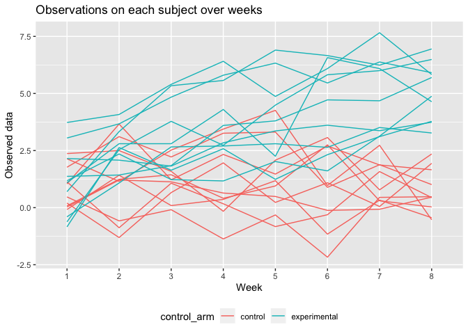
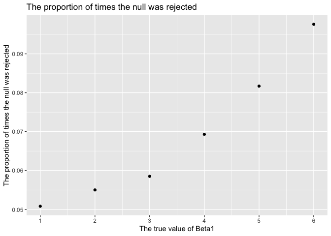

p8105\_hw5\_ra2965
================
Ran An

``` r
library(tidyverse)

set.seed(10)

iris_with_missing = iris %>% 
  map_df(~replace(.x, sample(1:150, 20), NA)) %>%
  mutate(Species = as.character(Species)) %>% 
  janitor::clean_names()
```

Problem1
========

Write a function that takes a vector as an argument; replaces missing values using the rules defined above; and returns the resulting vector:

``` r
fill_missing = function(x){
  if (is.numeric(x)) {
    x = replace_na(x, mean(x, na.rm = TRUE))
  } else if (is.character(x)) {
    x = replace_na(x, "virginica")
  }
}

output_iris = map_df(iris_with_missing,fill_missing)
```

Problem2
========

Create a tidy dataframe containing data from all participants, including the subject ID, arm, and observations over time:

``` r
hw5 = list.files(path = "./data") 

data_files =  data_frame(files = hw5) %>%  
  mutate(
    data = map(files, ~read_csv(str_c("./data/", .x)))
  ) %>% 
  unnest(cols = data) %>% 
  pivot_longer( 
    week_1:week_8,
    names_to = "week",
    names_prefix = "week_",
    values_to = "data"
  ) %>% 
  mutate(
    control_arm = str_extract(files, "[:lower:]{3}"),
    subject_id = str_extract(files, "\\d{2}")
  ) %>% 
  select(control_arm,subject_id,everything()) %>% 
  select(-files) %>% 
  mutate(
   control_arm = recode(control_arm, con = "control", exp = "experimental")
  )
```

Make a spaghetti plot showing observations on each subject over time, and comment on differences between groups:

``` r
data_files %>% 
  mutate(arm_id = str_c(control_arm,'_',subject_id)) %>% 
  ggplot(aes(x = week, y = data, color = control_arm, group = arm_id)) +
  geom_line() +
  labs(
    title = "Observations on each subject over weeks",
    x = "Week",
    y = "Observed data"
  ) + theme(
    legend.position = "bottom"
  )
```

 Comment: The observed data in control arm is lower than the experimental group. The observed data in experimental group is slightly increasing while the data in the control group is not.

Problem3
========

``` r
sim_regression = function(n = 30, beta0 = 2, beta1) {
  
  sim_data = tibble(
    x = rnorm(n, mean = 1, sd = 1),
    y = beta0 + beta1 * x + rnorm(n, 0, 50)
  )
  
  ls_fit = lm(y ~ x, data = sim_data)
  
  tibble(
    beta1_hat = coef(ls_fit)[2],
    p_value = broom::tidy(ls_fit)$p.value[2]
  )
}

output = rerun(10000, sim_regression(beta1 = 0)) %>% bind_rows()
```

``` r
sim_results = 
  tibble(beta1_n = c(1, 2, 3, 4,5,6)) %>% 
  mutate(
    output_lists = map(.x = beta1_n, ~rerun(10000, sim_regression(beta1 = .x))),
    estimate_dfs = map(output_lists, bind_rows)) %>% 
  select(-output_lists) %>% 
  unnest(estimate_dfs)
```

``` r
reject_prop = sim_results %>% 
  mutate(
    rejection = ifelse(p_value < 0.05,'rej','notrej')
  ) %>% 
  group_by(beta1_n,rejection) %>% 
  summarise(rej = n()) %>% 
  pivot_wider(
    names_from = rejection,
    values_from = rej
  ) %>% 
  mutate(
    rej_prop = rej/(rej + notrej))
    
ggplot(reject_prop, aes( x = beta1_n, y = rej_prop)) +
  geom_point() +
  labs(
    title = 'The proportion of times the null was rejected',
    x = 'The true value of Beta1',
    y = 'The proportion of times the null was rejected'
  ) + 
  scale_x_continuous(
    breaks = c(1, 2, 3,4,5,6))
```



Describe the association between effect size and power: Power is the probability of rejecting null given the null is not true. From this plot, it is clearly that the power will increase if the effect size increases.
